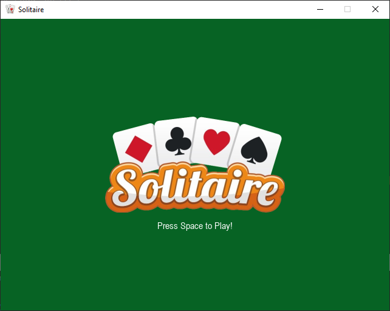
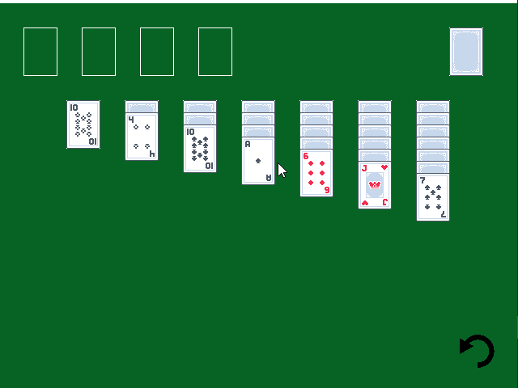
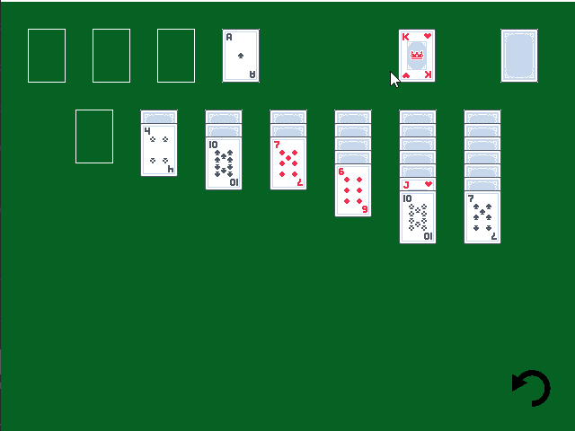
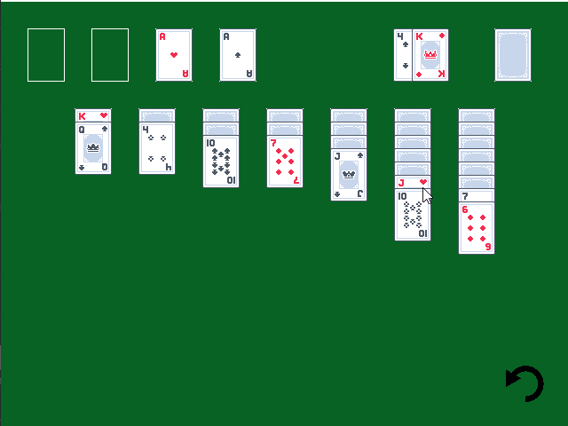
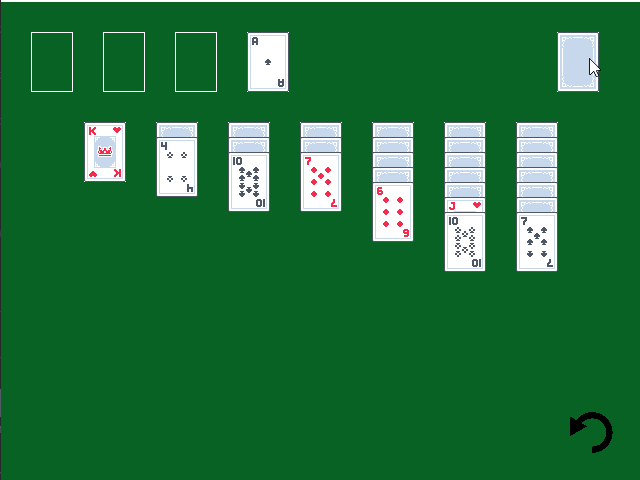

# solitaire
A simple version of solitaire 
The game starts up to a menu screen: 
 
Pressing space starts the game. 
 
Left clicking grabs a card, and the rules are the same as regular solitaire. 
 
 
Multiple cards can be moved at the same time: 
 
And pressing the black arrow at the bottom right undoes a move, up to 10 moves back: 
 
